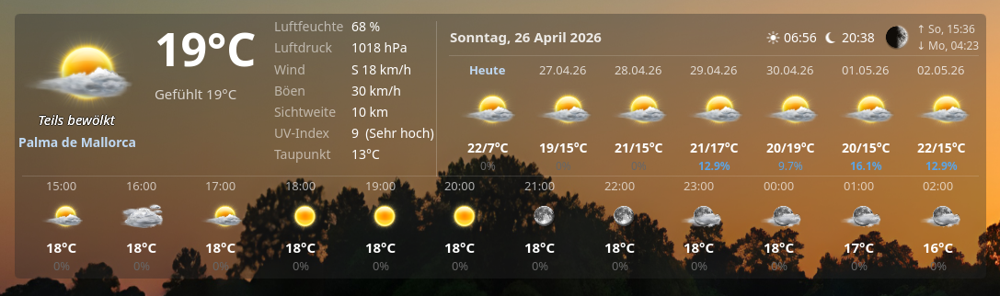
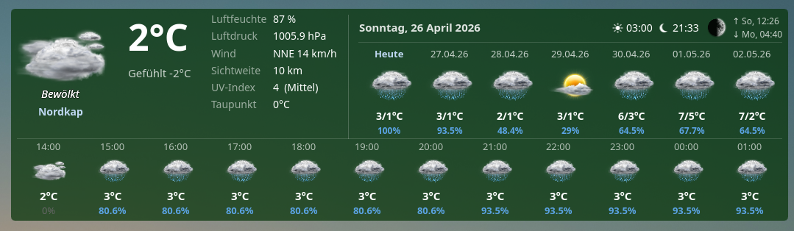
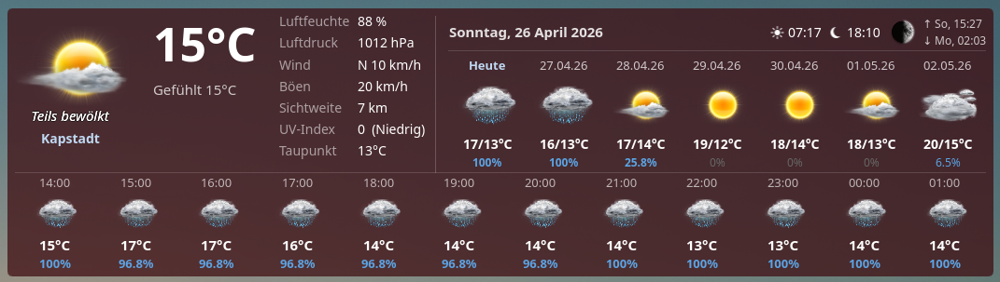
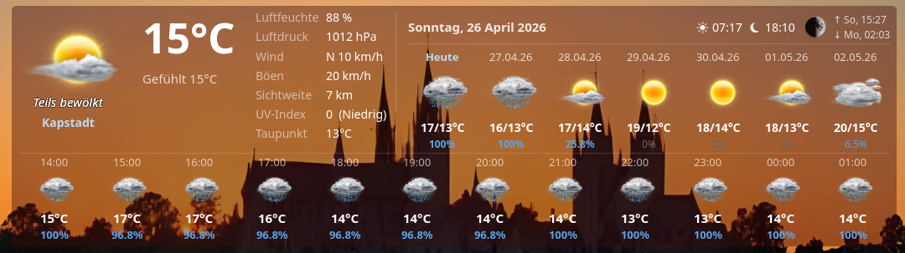
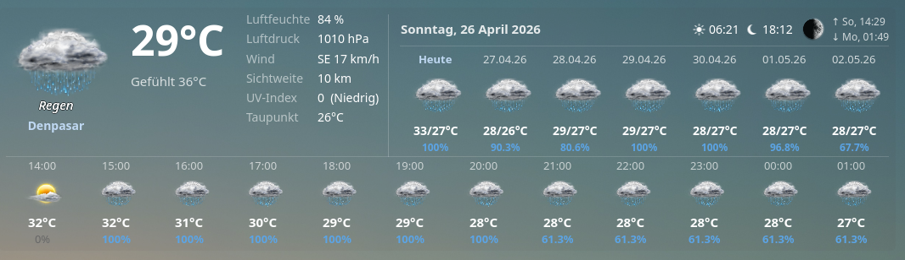
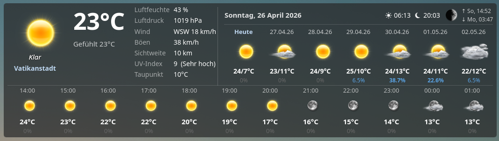

# Fancy KDE Weather

A KDE Plasma 6 widget displaying current weather conditions, a 12-hour hourly forecast, and a 7-day daily forecast — powered by the [Visual Crossing](https://www.visualcrossing.com) weather API.



## Features

- **Current conditions:** temperature, feels-like, humidity, pressure (with trend), wind & gusts, visibility, UV index, dew point
- **12-hour hourly forecast:** icon, temperature, precipitation chance
- **7-day daily forecast:** icon, high/low temperature, precipitation chance
- **Astro info:** sunrise, sunset, moon phase, moonrise/moonset with day prefix
- **Live clock** (optional, toggleable)
- **Localized weather descriptions** in 10 languages (de, en, fr, es, it, nl, pl, pt, ru, zh)
- **UI language** follows your KDE system locale (English default, German included)
- **Customizable background** color and opacity
- **Compact panel mode** with icon + temperature

## Screenshots

**Darkgreen Background (Solid)**



</br>

**Darkred Background (Solid)**



</br>

**Darkred Background (40% Transparent)**



</br>

**Grey Background (3% Transparent)**



</br>

**Darkgrey Background (70% Transparent)**



## Requirements

- KDE Plasma **6.0** or later
- Qt 6 + Kirigami + kquickcontrols (included in standard `plasma-workspace` on most distros)
- A free [Visual Crossing API key](https://www.visualcrossing.com) (1,000 requests/day on the free plan)

| Distribution | Package |
|---|---|
| Arch / CachyOS / Manjaro | `plasma-workspace` |
| Fedora | `plasma-workspace`, `kf6-kquickcontrols` |
| openSUSE | `plasma6-workspace` |
| Kubuntu / KDE Neon | `plasma-workspace` |

## Installation

### Via KDE Store (recommended)

1. Right-click the desktop → **Add Widgets…** → **Get New Widgets…**
2. Search for **Fancy KDE Weather**
3. Install and add to desktop or panel

### Manual installation

```bash
git clone https://github.com/Fiiti/fancy-kde-weather.git
cd fancy-kde-weather
cp -r io.github.fiiti.fancykdeweather/. ~/.local/share/plasma/plasmoids/io.github.fiiti.fancykdeweather/
kquitapp6 plasmashell && kstart plasmashell
```

Then right-click the desktop → **Add Widgets…** → search for **Fancy KDE Weather**.

## Configuration

Right-click the widget → **Configure Widget…**

| Setting | Description |
|---|---|
| API Key | Your Visual Crossing API key |
| Latitude / Longitude | Location coordinates ([mapcoordinates.net](https://www.mapcoordinates.net)) |
| Language | Language for weather descriptions (independent of UI language) |
| Units | Metric / Imperial / Hybrid |
| Update interval | Data refresh interval in minutes (default: 10, max: 1440) |
| Show clock | Toggle the live clock in the info bar |
| Background color / Opacity | Widget appearance |

> **Note:** Enter coordinates with a decimal **point**, not a comma — e.g. `52.520008`, not `52,520008`.

## Updating

After pulling new code:

```bash
cp -r io.github.fiiti.fancykdeweather/. ~/.local/share/plasma/plasmoids/io.github.fiiti.fancykdeweather/
kquitapp6 plasmashell && kstart plasmashell
```

## License

MIT — see [LICENSE](LICENSE)
